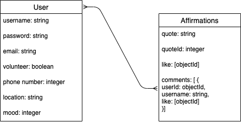
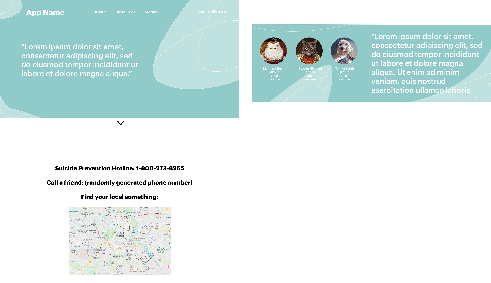
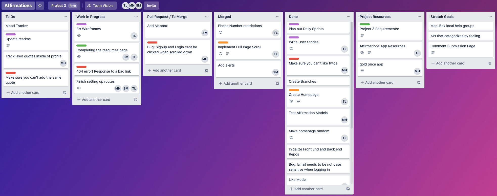
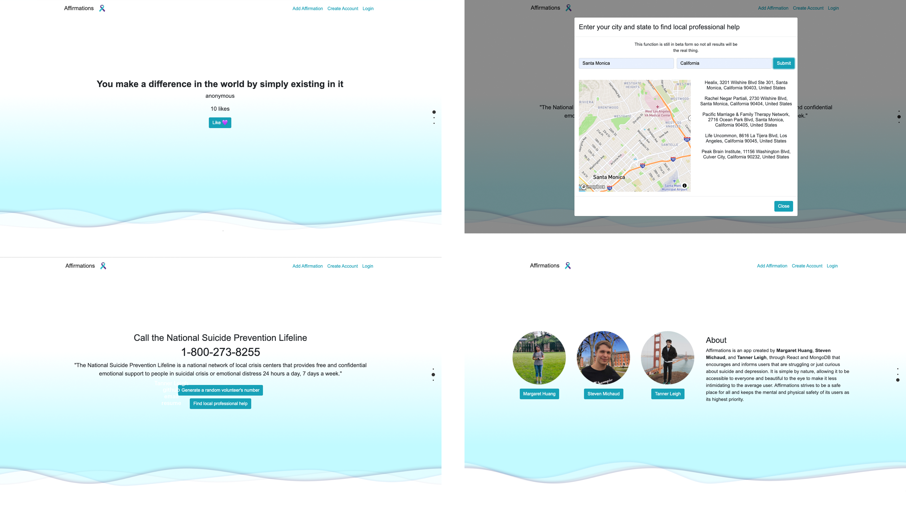

# Affirmations

Affirmations is an app created by [Margaret Huang](https://github.com/margaret-jihua), [Steven Michaud](https://github.com/Michaudsr), and [Tanner Leigh](https://github.com/thleigh) through React and MongoDB that encourages and informs users that are struggling or just curious about suicide and depression.
It is simple by nature, allowing it to be accessible to everyone and beautiful to the eye to make it less intimidating to the average user. 
Affirmations strives to be a safe place for all and keeps the mental and physical safety of its users as its highest priority.

During these challenging times, it's more important than ever to break stigmas and talk about mental health. We encourage 
everyone to take care of themselves, look out for others, and have open and honest conversations about our thoughts and feelings.

Site: [Affirmations](https://affirmations-client.herokuapp.com)

Back-end Repo: [Back-end](https://github.com/thleigh/Affirmations-Backend)

## Features

*  Every user will be greeted with a daily inspirational/affirming quote. Users can save quotes to their profile by liking and submit quotes of their own.
*  Users will have access to the suicide prevention hotline and find professional help in their area. If they feel intimidated to do so, users can chat with other users for more personal advice.

## Installation & Setup

First, we need to set up npm. Use the npm install command to install all dependencies from the `package.json`.

`$npm install`

Your `package.json` should look like this:
```
{
  "name": "frontend",
  "version": "0.1.0",
  "private": true,
  "dependencies": {
    "@fullpage/react-fullpage": "^0.1.17",
    "@mapbox/mapbox-sdk": "^0.11.0",
    "@testing-library/jest-dom": "^4.2.4",
    "@testing-library/react": "^9.5.0",
    "@testing-library/user-event": "^7.2.1",
    "axios": "^0.20.0",
    "bootstrap": "^4.5.2",
    "events": "^3.2.0",
    "jwt-decode": "^2.2.0",
    "mapbox-gl": "^1.12.0",
    "react": "^16.13.1",
    "react-bootstrap": "^1.3.0",
    "react-dom": "^16.13.1",
    "react-mapbox-gl": "^4.8.6",
    "react-motion": "^0.5.2",
    "react-phone-input-2": "^2.13.8",
    "react-router-dom": "^5.2.0",
    "react-scripts": "3.4.3",
    "react-transition-group": "^1.2.1"
  },
  "scripts": {
    "start": "react-scripts start",
    "build": "react-scripts build",
    "test": "react-scripts test",
    "eject": "react-scripts eject"
  },
  "eslintConfig": {
    "extends": "react-app"
  },
  "browserslist": {
    "production": [
      ">0.2%",
      "not dead",
      "not op_mini all"
    ],
    "development": [
      "last 1 chrome version",
      "last 1 firefox version",
      "last 1 safari version"
    ]
  }
}
```

After installing, we need to create a `.env` that contains the your `local host Url`, the api key for `React-fullpage`, and the api key for `Map-Box GL`.

In the `.env` file, insert:
* `REACT_APP_SERVER_URL='your local host url'`
* `SCROLL_KEY='your React-fullpage key'`
* `REACT_APP_MAP_TOKEN='you Map-Box GL key'`

You can sign-up and request your keys at [https://github.com/alvarotrigo/react-fullpage](https://github.com/alvarotrigo/react-fullpage) and [https://docs.mapbox.com/mapbox-gl-js/api/](https://docs.mapbox.com/mapbox-gl-js/api/)

In order to get access to the databases, the backend must be installed as well.

[Back-end](https://github.com/thleigh/Affirmations-Backend)

Make sure to run `$npm install` in the backends command line.

After the backend has been installed, run it by using the command:

`$node server.js`

Then, run the front end by using the command:

`$npm start`


## Technologies

* [React](https://reactjs.org/)
* [Map-Box GL](https://docs.mapbox.com/mapbox-gl-js/api/) : used to find and show local professional help for users.
* [Passport/Authapp](http://www.passportjs.org/) : allows authentication when using a password and username.
* [Mongoose](https://mongoosejs.com/) : used to build schema-based solutions to model our application's data.
* [Heroku](https://dashboard.heroku.com/apps) : houses the app.
* [React-FullPage](https://github.com/alvarotrigo/react-fullpage) : creates the full page scroll on our main page.
* [React Bootstrap](https://react-bootstrap.github.io/) : provides some design aspects for out buttons and forms. 

## Preparation 

We wanted to make things as simple as possible for the user. User's shouldn't have to feel intimidated or pressured by a website that has a lot of small text. We decided to use bootstrap as our main design too to provide smooth transitions and beautiful little buttons and forms. 

We wanted everything to be accessible to the user. So we chose to use React-fullpage in order to add the full page scroll effect and keeping all the information the user may need inside of 3 quick scrolls. 

Below is the ERD that we created to plan out our models. Having an ERD was an essential tool for our planning process. It helped us visually see our models and provide the team with efficient time to code. 
To further prove our point. We initially thought we needed 4 models, but after creating the ERD, we realized we only needed 2. This saved us a lot of time.



This is our wireframe. We made a wireframe to set what we wanted to see on our website before writing a single line of code. Although the final site does not look exactly the same, it saved us a lot of time.



## Keeping Organized

A powerful tool that helped the team keep organized was [Trello](https://trello.com/).
We set our Trello board to have a column for To-do, Work in Progress, Pull Request/Merge, Merged, Done, Project Resources, and Strech Goals. This helped us keep track of each team member's progress and where we needed to spend
more of our time. It helped us organize sprints and effectively and satisfyingly see our goals.



## Component Hierarchy:

```
App
|--NavBar
|   |--NewAffirmation
|
|--Signup
|
|--Login
|
|--Profile(Private)
|
|--FullPage
|   |--Welcome
|   |   |--Affirmation
|   |--Resources
|   |   |--MapBox
|   |--About
|
|--Background
|
|--Flash
```

# Conclusion
Affirmations was started on September 4th, 2020 and was completed on September 11th, 2020. Approximately 50% of this site was created through pair programming. Each member played an essential role in the creation of this site and we are very proud of the outcome. Please contact us if you would like to know more about our project and/or if you have any job openings for us 🥰.

## The Final Look

